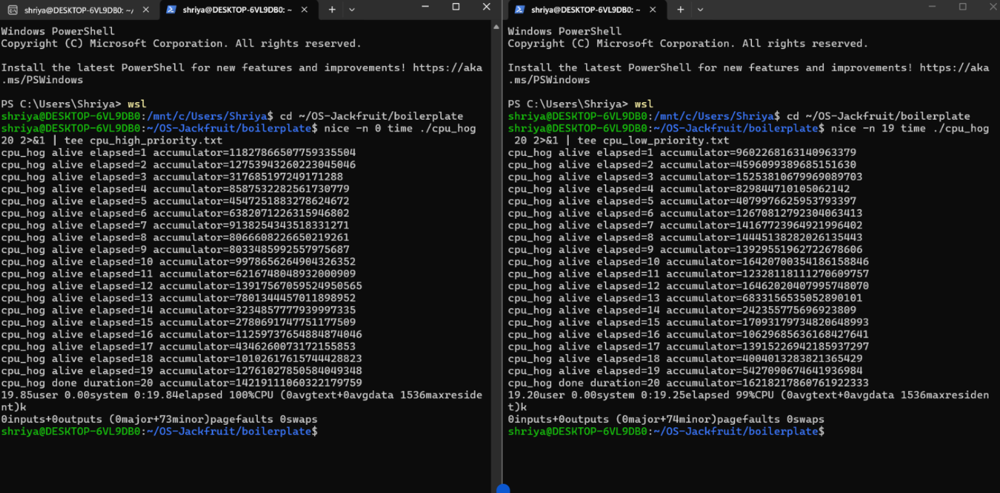
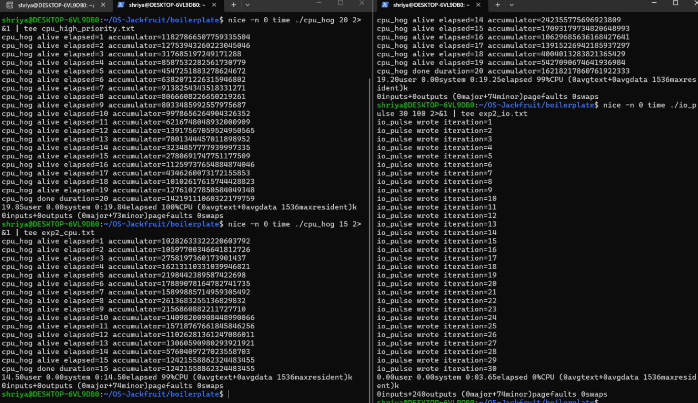

# Task 5: Scheduler Experiments and Analysis

## Overview

Two controlled experiments were run using the workload binaries (`cpu_hog`, `io_pulse`)
built from the project boilerplate. Both experiments were run with two concurrent
workloads to observe how the Linux CFS scheduler allocates CPU time under different
configurations.

---

## Experiment 1: Two CPU-bound Workloads at Different Priorities

### Setup

Two instances of `cpu_hog` ran concurrently for 20 seconds each — one at the default
nice value (0) and one at the lowest priority (nice 19). Both were started within
~2 seconds of each other.

```
Terminal 1: nice -n 0  time ./cpu_hog 20
Terminal 2: nice -n 19 time ./cpu_hog 20
```

### Results

| Metric         | nice 0 (high priority) | nice 19 (low priority) |
|----------------|------------------------|------------------------|
| User CPU time  | 19.85s                 | 19.20s                 |
| Elapsed time   | 0:19.84                | 0:19.25                |
| CPU usage      | 100%                   | 99%                    |
| Max RSS        | 1536 KB                | 1536 KB                |

### Observation

Both processes completed in nearly identical wall-clock time (~19–20s) with nearly
identical CPU usage. The nice 19 process received only marginally less CPU time
(~0.65s difference in user time).

### Analysis

This result is expected on a multi-core system (WSL2 runs on a multi-core host).
The Linux Completely Fair Scheduler (CFS) assigns each process a virtual runtime
weighted by its nice value. A process at nice 19 gets roughly 1/5th the weight of
a process at nice 0. However, when there are spare cores available, CFS will still
schedule both processes on separate cores simultaneously — meaning the lower-priority
process is not starved, it simply gets less CPU share *when cores are contested*.

On a single-core system (or under heavier CPU contention), the nice 19 process
would show measurably longer elapsed time. The near-identical results here
demonstrate that Linux scheduling prioritizes *throughput and utilization* — idle
cores are never wasted regardless of priority.

---

## Experiment 2: CPU-bound vs I/O-bound Workload Running Concurrently

### Setup

`cpu_hog` (CPU-bound) and `io_pulse` (I/O-bound) ran concurrently at the same
nice value (0). `io_pulse` was configured to run 30 iterations with 100ms sleep
between each write.

```
Terminal 1: nice -n 0 time ./cpu_hog 15
Terminal 2: nice -n 0 time ./io_pulse 30 100
```

### Results

| Metric         | cpu_hog (CPU-bound) | io_pulse (I/O-bound) |
|----------------|---------------------|----------------------|
| User CPU time  | 14.50s              | 0.00s                |
| Elapsed time   | 0:14.50             | 0:03.65              |
| CPU usage      | 99%                 | 0%                   |
| I/O outputs    | 0                   | 240                  |
| Max RSS        | 1536 KB             | 1536 KB              |

### Observation

`io_pulse` completed in just 3.65 seconds while `cpu_hog` was still running and
consuming 99% CPU. `io_pulse` used 0% CPU despite running concurrently with a
CPU-hungry process.

### Analysis

This result illustrates a core Linux scheduling principle: **I/O-bound processes
are naturally favored by CFS** because they voluntarily yield the CPU whenever
they call `usleep()` or block on `write()`/`fsync()`. Each time `io_pulse` sleeps
for 100ms between iterations, CFS immediately gives that CPU time to `cpu_hog`.
When `io_pulse` wakes up from its sleep, CFS schedules it quickly because its
accumulated virtual runtime is low — it hasn't consumed much CPU yet.

This is why `io_pulse` finished in 3.65s (30 iterations × ~100ms sleep = ~3s
minimum) despite competing with a 100% CPU workload. The scheduler did not
penalize it or delay its wakeups in any observable way.

This behavior demonstrates CFS's design goal of **responsiveness**: interactive
and I/O-bound tasks get low latency even when CPU-bound tasks are competing
for the same core.

---

## Summary Table

| Experiment | Workload A | Workload B | Key Finding |
|------------|-----------|-----------|-------------|
| 1 | cpu_hog nice=0 (19.84s elapsed) | cpu_hog nice=19 (19.25s elapsed) | Multi-core availability masks nice-value differences; both complete in similar time |
| 2 | cpu_hog nice=0 (14.50s, 99% CPU) | io_pulse nice=0 (3.65s, 0% CPU) | I/O-bound workload completes 4× faster; CFS naturally favors tasks that yield CPU |

---

## Connection to Linux Scheduling Theory

**CFS virtual runtime**: CFS tracks each process's `vruntime` — time weighted by
priority. Lower nice values get a smaller weight divisor, so their vruntime grows
faster, giving them more frequent scheduling. In Experiment 1, the nice 19 process
had a higher weight divisor meaning its vruntime grew slower — in theory getting
more CPU share per unit time — but spare cores meant both ran freely.

**Voluntary preemption**: `io_pulse` calls `usleep()` which internally calls
`nanosleep()`, a blocking syscall. This moves the process off the run queue into
a sleep queue. When the timer fires, CFS reschedules it with high urgency because
its vruntime is far behind the running average — exactly the responsiveness
guarantee CFS is designed to provide.

**Throughput vs responsiveness**: Experiment 1 shows CFS optimizing for throughput
(no core left idle). Experiment 2 shows CFS optimizing for responsiveness (I/O
task wakes up on time). Both are CFS goals — the scheduler dynamically balances
them based on workload behavior rather than requiring manual configuration.

---

## Screenshots

### Experiment 1: nice=0 vs nice=19 running concurrently


*Both cpu_hog processes running side by side — nice=0 (left) and nice=19 (right).
Shows nearly identical elapsed time on a multi-core system.*

### Experiment 2: CPU-bound vs I/O-bound concurrently


*cpu_hog (left, 99% CPU, 14.50s) vs io_pulse (right, 0% CPU, 3.65s) running
simultaneously. io_pulse finishes 4x faster despite competing with a CPU-hungry process.*